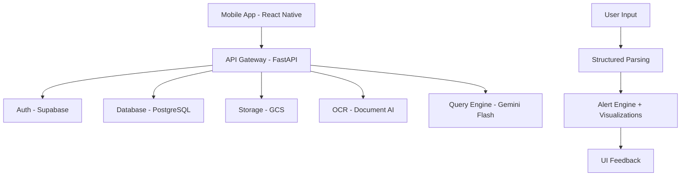

# 🏥 AI-Powered Medical Data Hub

> **A  mobile health platform that helps users track symptoms, medications, lab results, and prescriptions—surfacing early insights and potential side effects using AI.**

[](https://reactnative.dev/)
[](https://fastapi.tiangolo.com/)
[](https://postgresql.org/)
[](https://cloud.google.com/ai)
[](https://typescriptlang.org/)

---

## 📱 Overview

The AI-Powered Medical Data Hub is a mobile-first health companion that goes beyond storage and search. It enables users to **log health events**, **analyze medical documents**, and **proactively identify correlations**, such as possible side effects from medications. Natural language querying unlocks an intuitive way to explore structured medical data—all while ensuring security and privacy.

---

## 🔑 Key Features

* **📄 Smart Document Parsing**: OCR + NLP pipeline extracts structured information from prescriptions, lab results, and test reports
* **💬 Natural Language Queries**: “Show all glucose tests in 2024” or “Which meds might cause dizziness?”
* **⚠️ Proactive Alerts**: Detect potential side effects by linking recent symptoms with current medications
* **📊 Health Timeline & Visuals**: Chronological view of meds, tests, and symptoms; trend graphs over time
* **💊 Medication & Symptom Tracker**: Manage medications and log health events with context
* **🔐 Security First**: Supabase Auth, HTTPS, RLS, encrypted storage
* **📲 Cross-Platform**: Built in React Native with full Android and iOS support

---

## 🧰 Tech Stack Overview

* **Frontend**: React Native, Expo, TypeScript, Zustand, NativeWind
* **Backend**: FastAPI, SQLAlchemy, PostgreSQL, Supabase Auth
* **AI & Cloud Services**: Google Document AI, Gemini 2.5 Flash, Google Cloud Storage

---

## 🧪 Example Use Case

A user uploads a prescription, logs “fatigue” as a symptom, and receives an alert that one of their medications lists fatigue as a common side effect. They export this insight to share with their doctor.

---

## 🏗️ Architecture



---

## 🚀 Getting Started

### Prerequisites

* Node.js (v18+)
* Python (3.11+)
* PostgreSQL (15+)
* Google Cloud account with Document AI + Gemini APIs
* Supabase project
* Expo CLI

### Installation Steps

#### 1. Clone and Setup Backend

```bash
git clone https://github.com/yourusername/medical-data-hub.git
cd medical-data-hub/backend

python3 -m venv venv && source venv/bin/activate
pip install -r requirements.txt
cp .env.example .env  # edit with DB and API keys

createdb medical_hub_db
alembic upgrade head
```

#### 2. Setup Frontend

```bash
cd ../frontend
npm install
cp .env.example .env  # edit API base URL and Supabase config
npx expo start
```

---

## 📚 API Reference

| Endpoint                | Method   | Description                  |
| ----------------------- | -------- | ---------------------------- |
| `/api/users/me`         | GET      | Get current user profile     |
| `/api/documents/upload` | POST     | Upload medical documents     |
| `/api/medications`      | GET/POST | Manage medications           |
| `/api/symptoms`         | GET/POST | Log and view symptoms        |
| `/api/alerts`           | GET      | View generated alerts        |
| `/api/query`            | POST     | Run natural language queries |

---

## 🛡️ Security Highlights

* Supabase-based JWT Auth
* Row-Level Security (RLS)
* Encrypted storage (PostgreSQL + GCS)
* Secure token handling (Expo SecureStore)
* Disclaimers enforcing **no medical advice**

---

## 🧠 AI Capabilities

* **OCR**: Google Document AI for high-accuracy parsing
* **Medical NLP**: Extracts medications, dosages, test names/values, and doctors
* **LLM Querying**: Gemini Flash API parses user questions into structured queries
* **Alert Engine**: Detects correlations between meds, symptoms, and lab values

---

## 🧪 Testing

```bash
# Backend tests
cd backend
python3 -m pytest tests/ -v
```

---

## 📦 Deployment Notes

* Backend deployable to GCP Cloud Run / AWS ECS
* Frontend deployable via Expo EAS or app stores
* Requires secured environment variables and cloud config

---

## 👨‍💻 Author

**Harshvardhan Chand**
[LinkedIn](https://www.linkedin.com/in/harshvardhan-chand/)
📧 [harshvardhan335@gmail.com](mailto:harshvardhan335@gmail.com)

---

## 🙏 Acknowledgments

* Google Cloud AI for LLM and OCR APIs
* Supabase for auth & RLS infra
* React Native + FastAPI community
* Healthcare workers who inspired this tool

---

**⭐ Star this repo if you believe AI can empower patients!**


