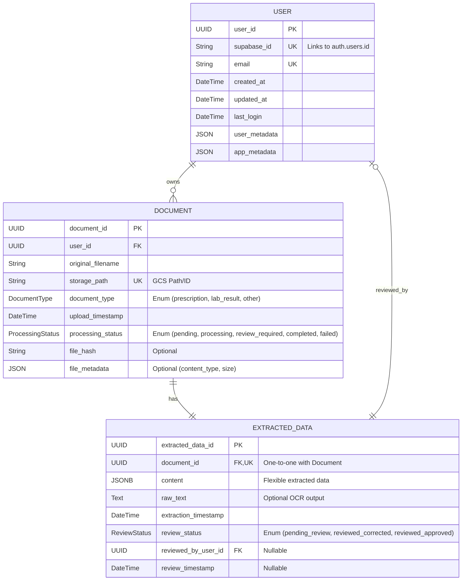

# Medical Data Hub - Architecture Documentation

## Overview

The Medical Data Hub is an AI-powered patient medical data management application built using modern, secure technologies. The application is designed with a clear separation of concerns, following best practices for security, maintainability, and scalability.

## Tech Stack

* **Backend**: Python 3.11 with FastAPI
* **Authentication**: Supabase
* **Database**: PostgreSQL with SQLAlchemy ORM
* **AI Document Processing**: Google Cloud Document AI (for OCR)
* **AI Language Processing**: Google Gemini (or other LLM, for structured data extraction - planned)
* **Frontend**: React Native (Mobile)
* **Cloud Platform**: Google Cloud Platform (GCP)

## Directory Structure

```
/
├── backend/                    # Backend API codebase
│   ├── alembic/                # Database migration scripts
│   ├── app/                    # Application code
│   │   ├── api/                # API endpoints
│   │   │   ├── endpoints/      # API route handlers
│   │   ├── core/               # Core functionality
│   │   │   ├── auth.py         # Authentication logic
│   │   │   ├── config.py       # Application configuration
│   │   │   └── logging_config.py # Logging configuration
│   │   ├── db/                 # Database management
│   │   │   └── session.py      # Database session management
│   │   ├── middleware/         # Middleware components
│   │   │   ├── rate_limit.py   # Rate limiting middleware
│   │   │   └── security.py     # Security headers middleware
│   │   ├── models/             # Data models
│   │   │   ├── user.py         # User data model
│   │   │   ├── document.py     # Document data model
│   │   │   └── extracted_data.py # ExtractedData model
│   │   ├── schemas/            # Pydantic schemas
│   │   └── utils/              # Utility functions
│   ├── tests/                  # Test directory
│   │   ├── unit/               # Unit tests
│   │   ├── integration/        # Integration tests
│   │   └── security/           # Security tests
│   ├── .env.example            # Example environment variables
│   ├── Dockerfile              # Docker configuration for backend
│   ├── alembic.ini             # Alembic configuration
│   ├── requirements.txt        # Python dependencies
│   └── pytest.ini              # Pytest configuration
├── frontend/                   # Frontend codebase
├── memory-bank/                # Documentation and planning
│   ├── architecture.md         # This file
│   ├── implementation.md       # Implementation plan
│   ├── progress.md             # Progress tracking
│   ├── prd.md                  # Product Requirements
│   └── tech-stack.md           # Tech stack details
└── package.json                # Root package.json
```

## Core Components

### 1. FastAPI Application (`backend/app/main.py`)

The main entry point of the backend application. It initializes the FastAPI app, configures middleware, sets up routes, and handles exception management. The application is designed to run on Python 3.11 to leverage modern language features and improved performance.

Key components:
- CORS configuration
- Security headers middleware
- Rate limiting integration
- Structured logging setup
- Exception handling
- API router registration

### 2. Authentication (`backend/app/core/auth.py`)

Handles user authentication using Supabase. It verifies JWT tokens provided in request headers and extracts user information for authorized endpoints.

Key components:
- JWT token verification with Supabase
- User identification and authorization
- Comprehensive error handling
- Security logging for authentication events

### 3. Configuration (`backend/app/core/config.py`)

Manages application configuration using environment variables with sensible defaults. Uses Pydantic Settings for validation and type safety. Loads from `.env` file.

Key components:
- Environment-specific settings
- Authentication configuration (Supabase URL, Key, JWT Secret)
- Database connection parameters (`DATABASE_URL`)
- Security settings
- API configuration

### 4. Database (`backend/app/db/session.py`)

Manages database connections and sessions using SQLAlchemy. Configured with connection pooling for optimized performance.

Key components:
- SQLAlchemy engine configuration (using `DATABASE_URL`)
- Connection pooling settings
- Session management (`SessionLocal`, `get_db` dependency)
- Base model class for ORM models (`Base`)

### 5. Models (`backend/app/models/`)

Contains SQLAlchemy ORM models that represent database tables.

*   **`User`**: Maps to `users` table. Stores basic user info, links to Supabase Auth via `supabase_id`.
*   **`Document`**: Maps to `documents` table. Represents an uploaded document (PDF, image), linking to a `User`. Includes details like filename, storage path, type, and processing status.
*   **`ExtractedData`**: Maps to `extracted_data` table. Stores structured data parsed from a `Document` using a flexible `JSONB` column. Links one-to-one with `Document` and includes review status details.

### 6. API Endpoints (`backend/app/api/endpoints/`)

Contains route handlers organized by functionality:
- `health.py`: Health check endpoint (`/api/v1/health`)
- `me.py`: User information endpoint (`/api/v1/me`, requires authentication)
- Future endpoints will handle document upload, data retrieval, review, etc.

### 7. Middleware (`backend/app/middleware/`)

Contains middleware components:
- `security.py`: Adds security headers to responses
- `rate_limit.py`: Implements rate limiting to prevent abuse

### 8. Testing (`backend/tests/`)

Contains test suites organized by type:
- Unit tests for individual components
- Integration tests for API endpoints
- Security tests for vulnerability checking

### 9. AI Document Processing (`backend/app/utils/ai_processors.py`)

Handles the initial step of document understanding, which is Optical Character Recognition (OCR).

Key components:
- **Google Cloud Document AI Integration**: Leverages Google Cloud Document AI for robust text extraction from various document formats (PDFs, images) stored in Google Cloud Storage.
- **Configuration**: Utilizes environment variables (loaded via `.env` files) for managing sensitive connection details (Project ID, Processor ID) for services like Document AI.
- **Utility Functions**: Provides functions like `process_document_with_docai` to encapsulate the logic for calling the Document AI service and retrieving raw text output.

## Database Schema Overview


*Note: `JSONB` is used for flexible storage in `ExtractedData`. `JSON` is used in `User` for Supabase compatibility.*

## Authentication Flow

1.  User authenticates with Supabase (frontend).
2.  Supabase issues a JWT token.
3.  Frontend includes the token in the Authorization header for backend requests.
4.  Backend `verify_token` dependency validates the token using `SUPABASE_JWT_SECRET`.
5.  If valid, endpoint handler receives the decoded token data (including `sub` which is the `auth.uid`).
6.  Backend logic uses `auth.uid` to find the corresponding user record in the `users` table via the `supabase_id` column.

## Security Features

1.  **JWT Authentication**: Secure token-based authentication with Supabase.
2.  **RLS**: Row Level Security enabled on all tables in the `public` schema, with policies restricting access based on the authenticated user (`auth.uid`).
3.  **Security Headers**: Middleware protection against common web vulnerabilities.
4.  **Rate Limiting**: Prevention of abuse and DoS attacks.
5.  **Structured Logging**: Comprehensive logging for security events.
6.  **Input Validation**: Pydantic schemas ensure data validation at API boundaries.
7.  **Exception Handling**: Secure error responses that don't leak sensitive information.
8.  **Database Connection Pooling**: Secure and efficient database access.
9.  **Environment Variables**: Sensitive credentials (DB URL, JWT Secret) managed via `.env` file (not committed to Git).

## Development Environment

The application is designed to be developed with Python 3.11 and uses modern tooling:
- Pytest for testing
- Alembic for database migrations
- Docker for containerization (optional)
- Environment variables (`.env` file) for configuration

**Important Note**: When running commands locally, make sure to use `python3` explicitly to target Python 3.11. The project requires Python 3.11 for certain language features and library compatibility.

```bash
# Use this command to verify your Python version
python3 --version  # Should show Python 3.11.x

# Run tests with Python 3.11
python3 -m pytest backend/tests/

# Start the backend server with Python 3.11
python3 -m uvicorn app.main:app --reload

# Run Alembic migrations
alembic upgrade head
```

## Next Steps

- Implement CRUD operations for `Document` and `ExtractedData`.
- Set up secure file storage (e.g., Google Cloud Storage).
- Implement document upload endpoint.
- **Integrate LLM (e.g., Gemini Flash) with the OCR output from Document AI for structured data extraction.**
- **Develop background task processing for the OCR and LLM pipeline.**
- **Define and implement storage for the structured data extracted by the LLM into the `ExtractedData` model.**
