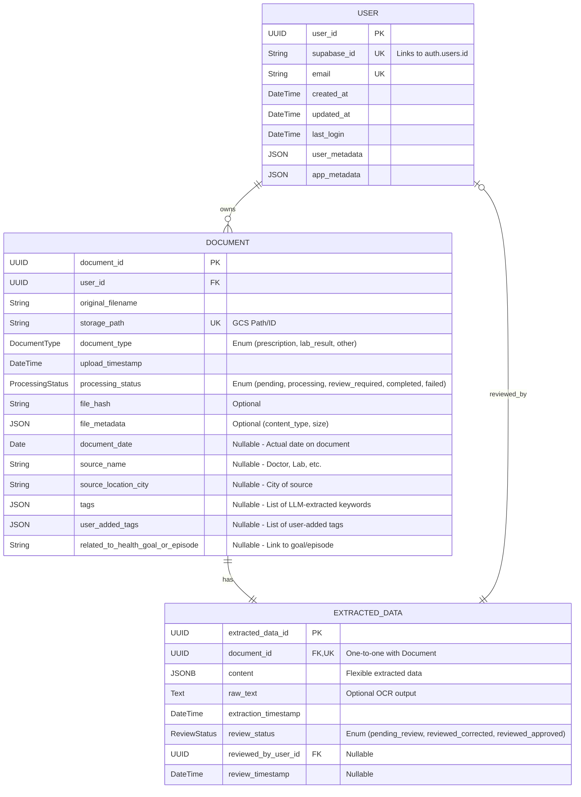

# Medical Data Hub - Architecture Documentation

## Overview

The Medical Data Hub is an AI-powered patient medical data management application built using modern, secure technologies. The application is designed with a clear separation of concerns, following best practices for security, maintainability, and scalability.

## Tech Stack

* **Backend**: Python 3.11 with FastAPI
  * Always use `python3` command instead of `python` to ensure the correct Python version is used
* **Authentication**: Supabase
* **Database**: PostgreSQL with SQLAlchemy ORM
* **AI Document Processing (OCR)**: Google Cloud Document AI
* **AI Language Processing (Semantic Structuring & Future Analysis)**: Google Gemini (or other LLM)
* **Frontend**: React Native (Mobile)
* **Cloud Platform**: Google Cloud Platform (GCP)

## Directory Structure

```
/
├── backend/                    # Backend API codebase
│   ├── alembic/                # Database migration scripts
│   ├── app/                    # Application code
│   │   ├── api/                # API related modules
│   │   │   ├── endpoints/      # API route handler modules (e.g., documents.py, users.py)
│   │   │   └── router.py       # Main API router (aggregates endpoint routers, mounted at /api)
│   │   ├── core/               # Core functionality
│   │   │   ├── auth.py         # Authentication logic (token verification, user retrieval)
│   │   │   ├── config.py       # Application configuration
│   │   │   └── logging_config.py # Logging configuration
│   │   ├── db/                 # Database management
│   │   │   └── session.py      # Database session management
│   │   ├── middleware/         # Middleware components
│   │   │   ├── rate_limit.py   # Rate limiting middleware
│   │   │   └── security.py     # Security headers middleware
│   │   ├── models/             # Data models
│   │   │   ├── user.py         # User data model
│   │   │   ├── document.py     # Document data model
│   │   │   ├── extracted_data.py # ExtractedData model
│   │   │   ├── medication.py   # Medication data model
│   │   │   └── health_reading.py # HealthReading data model
│   │   ├── repositories/       # Repository pattern implementation
│   │   │   ├── base.py         # Base CRUD repository 
│   │   │   ├── document_repo.py # Document repository implementation
│   │   │   ├── extracted_data_repo.py # ExtractedData repository
│   │   │   ├── user_repo.py    # User repository implementation
│   │   │   ├── medication_repo.py # Medication repository
│   │   │   └── health_reading_repo.py # HealthReading repository
│   │   ├── schemas/            # Pydantic schemas
│   │   │   ├── document.py     # Document schemas
│   │   │   ├── extracted_data.py # ExtractedData schemas
│   │   │   ├── user.py         # User schemas
│   │   │   ├── medication.py   # Medication schemas
│   │   │   └── health_reading.py # HealthReading schemas
│   │   ├── services/           # Business logic services
│   │   │   └── document_processing_service.py # Document processing pipeline
│   │   └── utils/              # Utility functions
│   │       ├── ai_processors.py # OCR and LLM utilities
│   │       └── storage.py      # Cloud storage utilities
│   ├── tests/                  # Test directory
│   │   ├── unit/               # Unit tests
│   │   ├── integration/        # Integration tests
│   │   └── security/           # Security tests
│   ├── .env.example            # Example environment variables
│   ├── Dockerfile              # Docker configuration for backend
│   ├── alembic.ini             # Alembic configuration
│   ├── requirements.txt        # Python dependencies
│   └── pytest.ini              # Pytest configuration
├── frontend/                   # Frontend codebase
├── memory-bank/                # Documentation and planning
│   ├── architecture.md         # This file
│   ├── implementation.md       # Implementation plan
│   ├── progress.md             # Progress tracking
│   ├── prd.md                  # Product Requirements
│   └── tech-stack.md           # Tech stack details
└── package.json                # Root package.json
```

## Core Components

### 1. FastAPI Application (`backend/app/main.py`)

The main entry point of the backend application. It initializes the FastAPI app, configures middleware, sets up routes, and handles exception management. The application is designed to run on Python 3.11 to leverage modern language features and improved performance.

Key components:
- CORS configuration
- Security headers middleware
- Rate limiting integration
- Structured logging setup
- Exception handling
- API router registration

### 2. Authentication (`backend/app/core/auth.py`)

Handles user authentication using Supabase. It verifies JWT tokens provided in request headers and extracts user information for authorized endpoints.

Key components:
- JWT token verification with Supabase
- User identification and authorization
- Comprehensive error handling
- Security logging for authentication events

### 3. Configuration (`backend/app/core/config.py`)

Manages application configuration using environment variables with sensible defaults. Uses Pydantic Settings for validation and type safety. Loads from `.env` file.

Key components:
- Environment-specific settings
- Authentication configuration (Supabase URL, Key, JWT Secret)
- Database connection parameters (`DATABASE_URL`)
- Security settings
- API configuration

### 4. Database (`backend/app/db/session.py`)

Manages database connections and sessions using SQLAlchemy. Configured with connection pooling for optimized performance.

Key components:
- SQLAlchemy engine configuration (using `DATABASE_URL`)
- Connection pooling settings
- Session management (`SessionLocal`, `get_db` dependency)
- Base model class for ORM models (`Base`)

### 5. Models (`backend/app/models/`)

Contains SQLAlchemy ORM models that represent database tables.

*   **`User`**: Maps to `users` table. Stores basic user info, links to Supabase Auth via `supabase_id`.
*   **`Document`**: Maps to `documents` table. Represents an uploaded document (PDF, image), linking to a `User`. Includes details like filename, storage path, type (`prescription`, `lab_result`, `other`), upload timestamp, processing status, and **enhanced metadata for filtering**:
    *   `document_date` (Date, Optional): Actual date on the report/document.
    *   `source_name` (String, Optional): Doctor, lab, or hospital name.
    *   `source_location_city` (String, Optional): City associated with the source.
    *   `tags` (JSON, Optional): List of LLM-extracted keywords (e.g., conditions, medications).
    *   `user_added_tags` (JSON, Optional): List of tags added manually by the user.
    *   `related_to_health_goal_or_episode` (String, Optional): User-defined link to a health goal or event.
*   **`ExtractedData`**: Maps to `extracted_data` table. Stores structured data parsed from a `Document` using a flexible `JSONB` column (`content`). Links one-to-one with `Document` and includes review status details.
*   **`Medication`**: Maps to `medications` table. Stores user-entered medication details.
*   **`HealthReading`**: Maps to `health_readings` table. Stores user-entered health metrics.

### 6. API Endpoints (`backend/app/api/endpoints/`)

Contains route handler modules (e.g., `documents.py`, `users.py`, `medications.py`, `extracted_data.py`, `query.py`, `health_readings.py`, `health.py`). These are aggregated by `backend/app/api/router.py` and mounted under `/api` in `backend/app/main.py`.

Example main endpoints (all prefixed with `/api`):
- `health.py`: Health check endpoint (e.g., `/api/health/health`)
- `users.py`: User related endpoints, including:
    - `/users/me`: User information endpoint for the authenticated user (full path: `/api/users/me`).
- `documents.py`: Endpoints for document management (e.g., `/documents/upload`, `/documents/{document_id}`).
- `extracted_data.py`: Endpoints for accessing and managing structured extracted medical data (e.g., `/extracted_data/{document_id}`).
- `medications.py`: Endpoints for medication management (e.g., `/medications/`, `/medications/{medication_id}`).
- `query.py`: Endpoint for natural language querying (e.g., `/query/`).
- `health_readings.py`: Endpoints for health reading management (e.g., `/health_readings/`, `/health_readings/{reading_id}`).

#### ExtractedData API Endpoints
The ExtractedData API provides endpoints for retrieving and updating structured medical data extracted from user documents. All paths are now prefixed with `/api` (e.g. `/api/extracted_data/...`).

**Endpoint Summary:**
- `GET /api/extracted_data/{document_id}`: Retrieve extracted data for a specific document
- `GET /api/extracted_data/all/{document_id}`: Get combined document and extracted data details
- `PUT /api/extracted_data/{document_id}/status`: Update the review status of extracted data
- `PUT /api/extracted_data/{document_id}/content`: Update the structured content of extracted data

**Authentication and Authorization:**
- All endpoints require a valid JWT token from Supabase
- Document ownership is verified on each request
- Users can only access and modify their own data

**Security Features:**
- Token-based authentication with Supabase JWT
- User ID extraction from token for authorization
- Document ownership validation
- Comprehensive error handling with appropriate HTTP status codes

**Data Flow:**
1. Client sends request with document ID and JWT token
2. Backend validates token and extracts user ID
3. Backend verifies document ownership
4. Repository layer handles database operations
5. Response includes extracted data or confirmation

These endpoints enable users to view and correct AI-extracted medical data before using it for analysis, ensuring data quality and accuracy.

### 7. Middleware (`backend/app/middleware/`)

Contains middleware components:
- `security.py`: Adds security headers to responses
- `rate_limit.py`: Implements rate limiting to prevent abuse

### 8. Testing (`backend/tests/`)

Contains test suites organized by type:
- Unit tests for individual components
- Integration tests for API endpoints
- Security tests for vulnerability checking

### 9. AI Document Processing (`backend/app/utils/ai_processors.py`)

Handles the initial step of document understanding through Optical Character Recognition (OCR). This component extracts raw text from uploaded medical documents.

Key components:
- **Google Cloud Document AI Integration**: Leverages Google Cloud Document AI for robust text extraction from various document formats (PDFs, images) stored in Google Cloud Storage.
- **Configuration**: Utilizes environment variables for managing Google Cloud service connections (Project ID, Processor ID).
- **Process Flow**:
  1. Documents are uploaded by users and stored in Google Cloud Storage
  2. Document processing service retrieves the document path
  3. `process_document_with_docai` function is called with the document's GCS URI
  4. Google Cloud Document AI processes the document and returns extracted text
  5. Extracted text is stored in the `raw_text` field of the `ExtractedData` model
- **Processor Selection**: Uses a specialized medical document processor trained on healthcare documents for better accuracy with medical terminology and document layouts.
- **Multilingual Support**: The Document AI processor can handle documents in multiple languages, expanding the application's utility in diverse healthcare environments.

### 10. AI Language Processing (`backend/app/utils/ai_processors.py`)

This section describes the different roles LLMs (currently Google Gemini) play in the application.

**A. Initial Document Structuring (`structure_text_with_gemini`)**

This component performs semantic structuring of the raw text extracted by the OCR process, transforming unstructured medical text into structured, queryable data. It is invoked once per document during background processing.

Key components:
- **LLM Integration**: Uses `gemini-1.5-flash-latest` via the `google-generativeai` library.
- **Prompt Engineering**: Utilizes `SYSTEM_PROMPT_MEDICAL_STRUCTURING` to guide the LLM.
- **Output 1 (Structured Content)**: Generates a structured JSON representation (`medical_events` list) stored in the `ExtractedData.content` field (JSONB).
- **Output 2 (Metadata - Future Enhancement)**: *This process should be enhanced* to also attempt extracting key metadata from the text (e.g., the actual `document_date`, `source_name`, `source_location_city`, and relevant `tags`) to populate the corresponding fields on the `Document` model, aiding later filtering.
- **Security/Determinism**: Uses API keys securely and low temperature for consistent structuring.

**B. Query Filter Extraction (`extract_query_filters_with_gemini` - New)**

This is the first LLM step in the user query process. It analyzes the user's natural language query to identify potential filter criteria based on the metadata available on the `Document` model.

Key components:
- **LLM Integration**: Uses `gemini-1.5-flash-latest`.
- **Input**: User's natural language query and context about filterable `Document` fields (e.g., `document_type`, `document_date`, `upload_timestamp`, `source_name`, `tags`, `user_added_tags`).
- **Prompt Engineering**: A specialized prompt guides the LLM to translate the query into filters.
- **Output**: Returns a JSON object representing the identified filters (e.g., `{"document_type": "LAB_RESULT", "date_range": {"start": "YYYY-MM-DD", "end": "YYYY-MM-DD"}, "tags_contain": ["glucose"]}`).
- **Purpose**: Enables the backend to retrieve a smaller, more relevant subset of documents before the final answering step.

**C. Contextual Query Answering (`answer_query_from_context`)**

This is the second LLM step in the user query process. It generates a natural language answer based on the user's query and the *filtered* set of structured data retrieved from the database.

Key components:
- **LLM Integration**: Uses `gemini-1.5-flash-latest`.
- **Input**: Original user query and a context string containing the `ExtractedData.content` JSON blobs from the documents selected by the filtering step.
- **Prompt Engineering**: A specific prompt instructs the LLM to answer the query *solely* based on the provided JSON context, avoiding external knowledge.
- **Output**: A natural language string answering the user's question or indicating if the information wasn't found in the provided context.

This multi-stage AI approach aims to provide accurate and relevant answers efficiently by first structuring the data, then intelligently filtering based on the query, and finally synthesizing an answer from the relevant context.

## Database Schema Overview


*Note: `JSONB` is used for flexible storage in `ExtractedData`. `JSON` is used in `User` for Supabase compatibility and for list storage in `Document`.*

## Repository Structure

The application uses a consistent repository pattern for database access with all repositories in the `repositories` directory:

```
app/
└── repositories/          # Main repository directory with plural naming convention
    ├── base.py            # Base CRUD repository with generic operations
    ├── document_repo.py   # Document repository implementation
    ├── user_repo.py       # User repository implementation
    └── extracted_data_repo.py # ExtractedData repository implementation
```

### Repository Pattern Implementation

The application uses the repository pattern to separate data access logic from business logic:

1. **Base Repository Class** (`app/repositories/base.py`):
   - Implements generic CRUD operations (Create, Read, Update, Delete)
   - Uses SQLAlchemy ORM for database operations
   - Leverages type variables for model and schema typing

2. **Specific Repository Classes**:
   - `DocumentRepository` - Handles document-related operations
   - `UserRepository` - Handles user-related operations
   - `ExtractedDataRepository` - Handles operations on extracted medical data

3. **Repository Usage Pattern**:
   - Some repositories (document_repo, user_repo) export singleton instances for direct use
   - Others (extracted_data_repo) need to be instantiated with a database session

### Repository Usage Example

Repositories are injected into services and API endpoints:

```python
# Example repository usage in API endpoint
@router.get("/{document_id}", response_model=ExtractedDataResponse)
def get_extracted_data(
    document_id: uuid.UUID,
    db: Session = Depends(get_db),
    token_data: dict = Depends(verify_token)
):
    # Get user ID from token
    user_id = get_user_id_from_token(db, token_data)
    
    # Use document repository (singleton)
    document = document_repo.get_document(db, document_id=document_id)
    
    # Use extracted data repository (instantiated)
    extracted_data_repo = ExtractedDataRepository(db)
    extracted_data = extracted_data_repo.get_by_document_id(document_id)
    
    return extracted_data
```

This structure ensures clear separation of concerns, consistent database access patterns, and testability.

## Authentication Flow

1.  User authenticates with Supabase (frontend).
2.  Supabase issues a JWT token.
3.  Frontend includes the token in the Authorization header for backend requests.
4.  Backend `verify_token` dependency validates the token using `SUPABASE_JWT_SECRET`.
5.  If valid, endpoint handler receives the decoded token data (including `sub` which is the `auth.uid`).
6.  Backend logic uses `auth.uid` to find the corresponding user record in the `users` table via the `supabase_id` column.

## Security Features

1.  **JWT Authentication**: Secure token-based authentication with Supabase.
2.  **RLS**: Row Level Security enabled on all tables in the `public` schema, with policies restricting access based on the authenticated user (`auth.uid`).
3.  **Security Headers**: Middleware protection against common web vulnerabilities.
4.  **Rate Limiting**: Prevention of abuse and DoS attacks.
5.  **Structured Logging**: Comprehensive logging for security events.
6.  **Input Validation**: Pydantic schemas ensure data validation at API boundaries.
7.  **Exception Handling**: Secure error responses that don't leak sensitive information.
8.  **Database Connection Pooling**: Secure and efficient database access.
9.  **Environment Variables**: Sensitive credentials (DB URL, JWT Secret) managed via `.env` file (not committed to Git).

## Development Environment

The application is designed to be developed with Python 3.11 and uses modern tooling:
- Pytest for testing
- Alembic for database migrations
- Docker for containerization (optional)
- Environment variables (`.env` file) for configuration

**Important Note**: When running commands locally, make sure to use `python3` explicitly to target Python 3.11. The project requires Python 3.11 for certain language features and library compatibility.

```bash
# Use this command to verify your Python version
python3 --version  # Should show Python 3.11.x

# Run tests with Python 3.11
python3 -m pytest backend/tests/

# Start the backend server with Python 3.11
python3 -m uvicorn app.main:app --reload

# Run Alembic migrations
alembic upgrade head
```

## Implementation Status

### Completed Components

- ✅ Core application structure and FastAPI configuration
- ✅ Basic authentication with Supabase JWT verification
- ✅ Database models (User, Document, ExtractedData)
- ✅ Repository pattern implementation with standardized naming conventions
- ✅ Document AI integration for OCR processing
- ✅ Gemini LLM integration for semantic structuring
- ✅ ExtractedData API endpoints for data retrieval and updates
- ✅ Background task processing pipeline for document analysis
- ✅ GCS storage integration for document storage
- ✅ Security features (authentication, authorization)
- ✅ Comprehensive testing framework with mock objects
-✅ Added enhanced metadata fields to Document model and DB schema
-✅ Updated Pydantic schemas for Document model
### In Progress

-🔄 Natural Language Querying (Filtered Approach):
Implement LLM-based filter extraction (LLM Call 2).
Implement document retrieval logic based on filters.
Implement contextual answering LLM call (LLM Call 3) using filtered data.
Refine prompts for all LLM calls.
-🔄 Enhance initial document processing (LLM Call 1) to extract new metadata (document_date, source_name, tags, etc.).
-🔄 Develop API endpoints for managing user tags/episodes

### Upcoming

- ⏳ Data export functionality
- ⏳ Advanced search capabilities
- ⏳ Integration with mobile application
- ⏳ Performance optimizations
- ⏳ Additional security hardening

## Frontend-Backend Integration

### API Client

The frontend communicates with the backend using a centralized API client built with Axios. This client:

1. Automatically attaches authentication tokens to requests
2. Handles common error responses (401, 500, etc.)
3. Provides consistent response handling

```typescript
// API client configuration
const apiClient = axios.create({
  baseURL: API_URL,
  headers: {
    'Content-Type': 'application/json',
  },
});

// Authentication token handling
apiClient.interceptors.request.use(
  async (config) => {
    const token = await SecureStore.getItemAsync('auth_token');
    if (token) {
      config.headers.Authorization = `Bearer ${token}`;
    }
    return config;
  }
);
```

### API Services

API functionality is organized into service modules:

- `authServices` - Authentication endpoints
- `documentServices` - Document management endpoints
- `extractedDataServices` - Extracted data endpoints
- `healthReadingsServices` - Health readings endpoints
- `medicationServices` - Medication management endpoints
- `queryServices` - AI query endpoints

### Authentication Flow

The application uses a token-based authentication system:

1. User logs in via the frontend authentication screens
2. Authentication token is stored securely using Expo SecureStore
3. API client automatically attaches the token to all requests
4. Backend validates the token and authorizes access to resources

### Error Handling

API errors are handled with a fallback strategy:

1. Attempt to use real API endpoints
2. On failure, fall back to mock data in development environments
3. Display appropriate error messages to users
4. Provide retry mechanisms for failed requests
